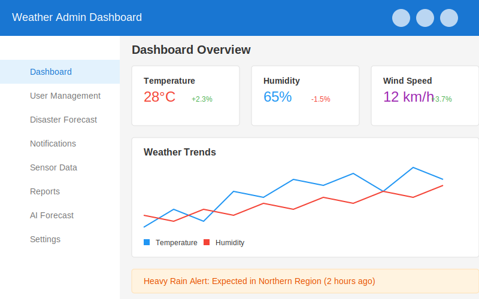
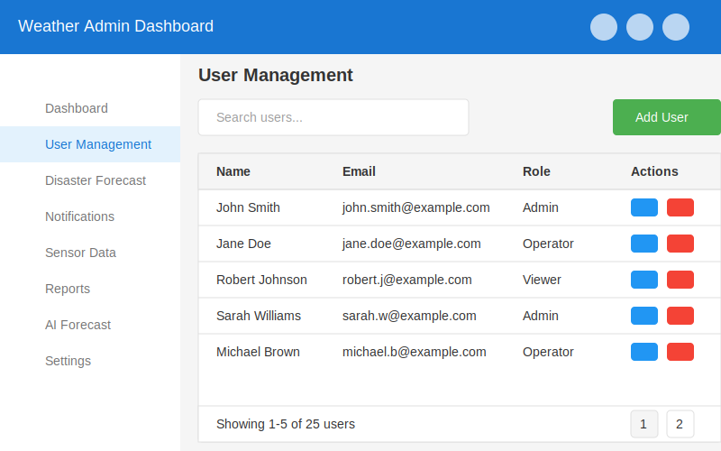
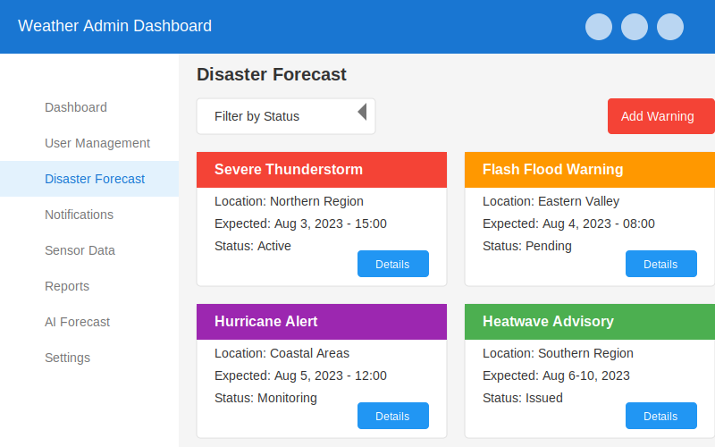

# Weather Admin Dashboard

## Overview

The Weather Admin Dashboard is a comprehensive web application built with React, TypeScript, and Material-UI. It provides a modern interface for managing weather data, user accounts, disaster forecasts, and notifications. The dashboard features a responsive design with dark/light theme support and interactive data visualizations.

## Features

- **Responsive Dashboard**: Modern UI with dark/light theme support
- **User Management**: Add, edit, and delete user accounts
- **Disaster Forecast**: Monitor and manage disaster warnings
- **Notifications System**: Create and manage notifications
- **Sensor Data Visualization**: Interactive charts for temperature, humidity, wind speed, and pressure
- **Reports Management**: Create and manage weather reports
- **AI Weather Forecast**: Advanced weather predictions using AI
- **Comprehensive Settings**: Customize dashboard appearance and functionality

## Screenshots

### Dashboard



The main dashboard provides an overview of key metrics, recent alerts, and weather trends.

### User Management



Manage user accounts with search functionality and user details.

### Disaster Forecast



Monitor and manage disaster warnings with filtering by status.

### Sensor Data


Visualize sensor data with interactive charts for temperature, humidity, wind speed, and pressure.

### AI Forecast


Advanced weather predictions using AI with trend analysis.

## Technology Stack

- **Frontend**: React, TypeScript
- **UI Library**: Material-UI
- **Routing**: React Router
- **Data Visualization**: Recharts
- **Build Tool**: Vite

## Getting Started

### Prerequisites

- Node.js (v14 or higher)
- npm or yarn

### Installation

1. Clone the repository
2. Install dependencies:
   ```
   npm install
   ```
3. Start the development server:
   ```
   npm run dev
   ```
4. Open your browser and navigate to `http://localhost:3000`

## Project Structure

```
├── public/
│   └── favicon.svg
├── src/
│   ├── components/
│   │   ├── Header.tsx
│   │   ├── Sidebar.tsx
│   │   ├── StatBox.tsx
│   │   └── Topbar.tsx
│   ├── pages/
│   │   ├── AIForecast.tsx
│   │   ├── Dashboard.tsx
│   │   ├── DisasterForecast.tsx
│   │   ├── Notifications.tsx
│   │   ├── Reports.tsx
│   │   ├── SensorData.tsx
│   │   ├── Settings.tsx
│   │   └── UserManagement.tsx
│   ├── App.tsx
│   ├── index.css
│   ├── main.tsx
│   └── theme.ts
├── index.html
├── package.json
├── tsconfig.json
├── tsconfig.node.json
└── vite.config.ts
```

## Future Enhancements

- Integration with backend API for real data
- User authentication and authorization
- Real-time notifications
- Mobile application
- Advanced data analytics

## License

MIT